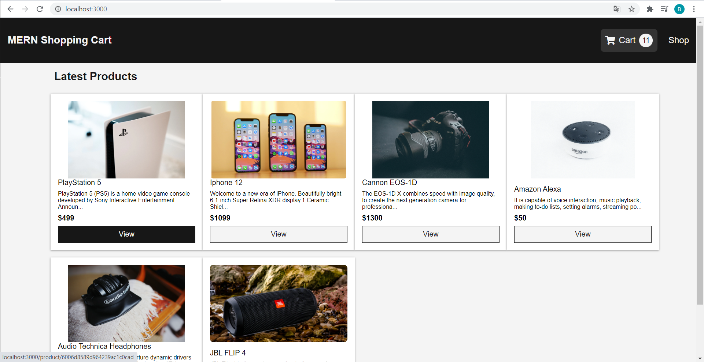

## About Project : MERN Shopping Cart

- Run Screen  
<p align="center"></p>  

- I made web application for studing  
  * What I referenced is below
      * Youtube : https://www.youtube.com/watch?v=0divhP3pEsg&t=12327s  
      * Github : https://github.com/LloydJanseVanRensburg/mini-mern-ecommerce-project

- What I used for these project is below  
  * Mongo DB (Database)
  * Express js (Server)
  * React js (Client)  
  * Redux (Client, State Container)

- How to build (Reference : ./package.json > scripts)
```
npm run dev
```

- Thanks a lot
